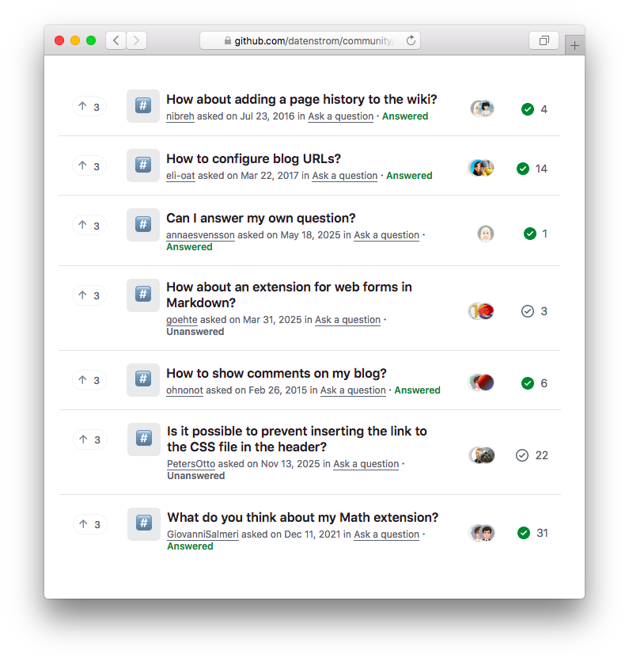

# Datenstrom community

Ask questions, report bugs and work with us. [View all discussions](https://github.com/datenstrom/community/discussions).

## How to work with us

We focus on people. Not on technical details and lots of features. There are many ways to become active in the Datenstrom community. Imagine what the user wants to do and what would make their life easier. Get familiar with files, folders and the API for developers. [See tips for working together](https://github.com/datenstrom/community/discussions/760).

## Acknowledgements

Made in Europe. Thank you to all developers, designers and translators.
